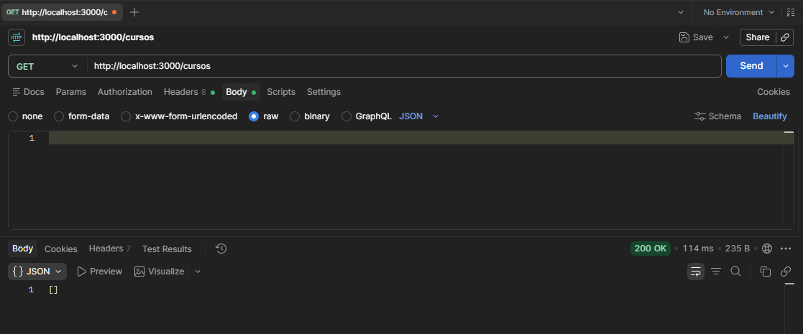
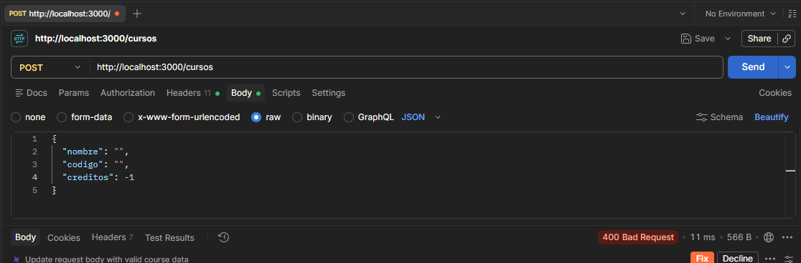
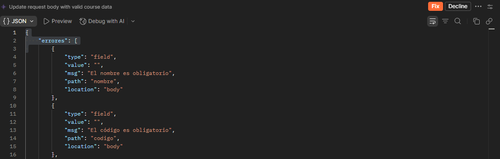
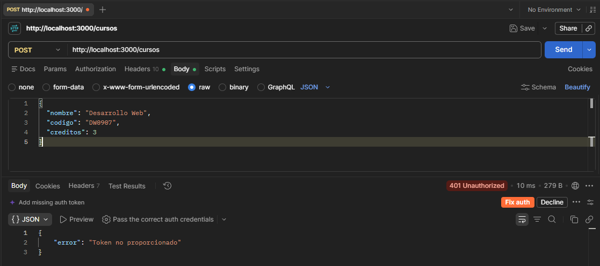
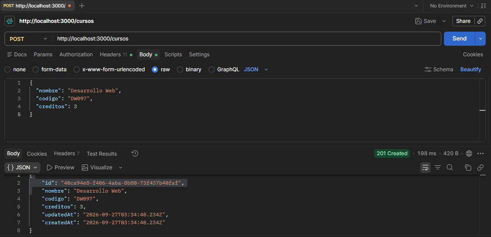
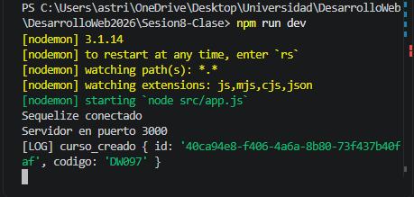
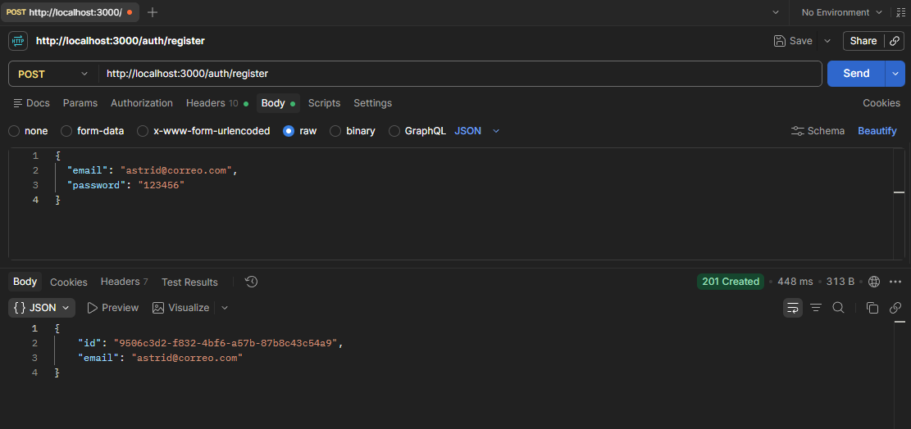
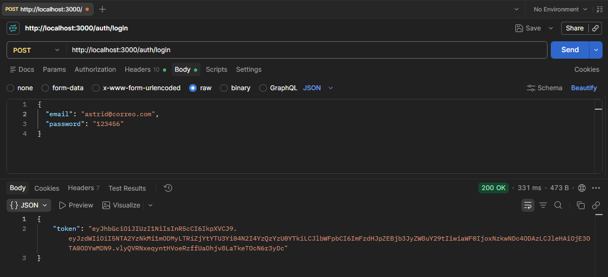
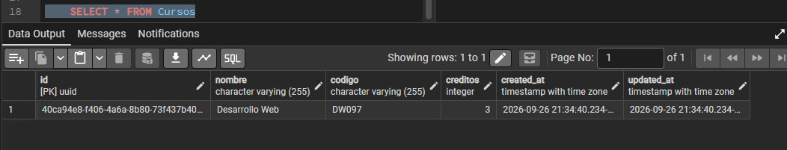
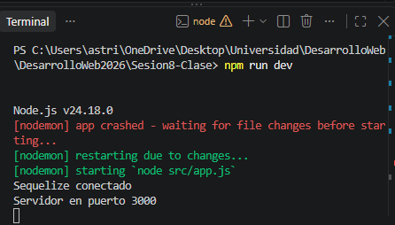

# Tarea Sesión 8 — API de Cursos con Express, Sequelize y JWT
 
## Descripción
 
API REST construida con Express y Sequelize (PostgreSQL) que expone un CRUD de cursos, con autenticación por JWT, sesiones persistidas en PostgreSQL y registro de eventos (log) al crear un curso.
 
## Estructura del proyecto
 
```
src/
├── config.js
├── db/
│   ├── pool.js
│   └── sequelize.js
├── models/
│   ├── Curso.js
│   └── Usuario.js
├── repositories/
│   ├── ICursosRepository.js
│   └── SequelizeCursosRepository.js
├── validators/
│   └── cursoValidator.js
├── middlewares/
│   ├── auth.js
│   └── errores.js
├── services/
│   └── logService.js
├── routes/
│   ├── auth.routes.js
│   └── cursos.routes.js
└── app.js
```
 
---
 
## Ejercicios en clase (1/2)
 
### 1. Modelo `Curso` (nombre, código único, créditos) + repositorio Sequelize
 
El modelo define `nombre`, `codigo` (único) y `creditos`, con su repositorio siguiendo el patrón `ICursosRepository` → `SequelizeCursosRepository`.

### 2. `GET /cursos` y `POST /cursos` con validación (`express-validator`)
 
**GET /cursos** (sin token, debe funcionar):
 

*Captura: respuesta 200 del GET /cursos*
 
**POST /cursos con datos inválidos** (debe dar 400):
 



*Captura: respuesta 400 con el array de errores de validación*
 
### 3. `POST /cursos` protegido con middleware `authJWT`
 
**POST /cursos sin token** (debe dar 401):
 


*Captura: respuesta 401 "Token no proporcionado"*
 
**POST /cursos con token válido** (debe dar 201):
 



*Captura: respuesta 201 con el curso creado*
 
---
 
## Ejercicios en clase (2/2)
 
### 4. Registro con bcrypt + login con JWT
 
**POST /auth/register:**
 

*Captura: respuesta 201 con el usuario creado (email + id)*
 
**POST /auth/login:**
 

*Captura: respuesta 200 con el token JWT*
 
### 5. Sesiones en PostgreSQL (reemplazo de MemoryStore) — sobrevive al reinicio
 
**Consulta a la tabla `session` en PostgreSQL:**
 

*Captura: `SELECT * FROM session;` mostrando la sesión activa*
 
### 6. Log fire-and-forget al crear un curso
 

*Captura: terminal del servidor mostrando `[LOG] curso_creado {...}` tras el POST exitoso*
 
---
